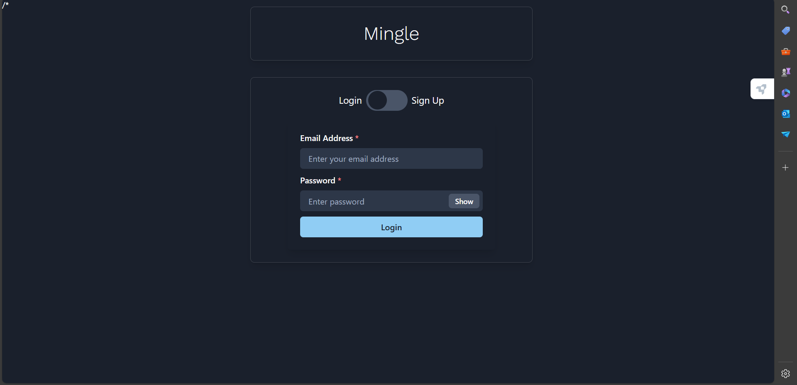
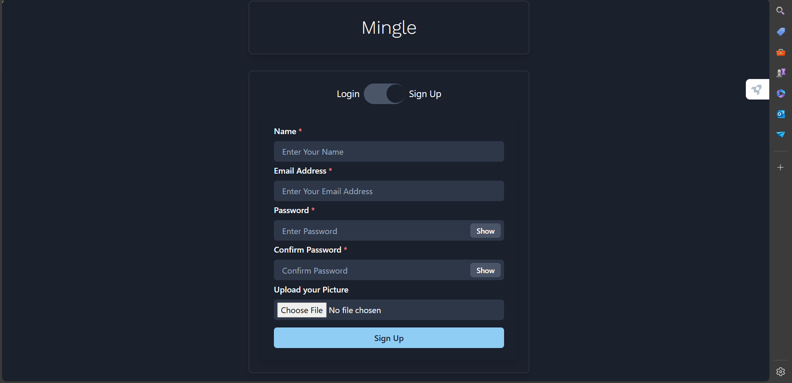
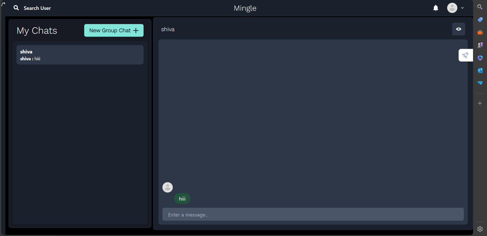
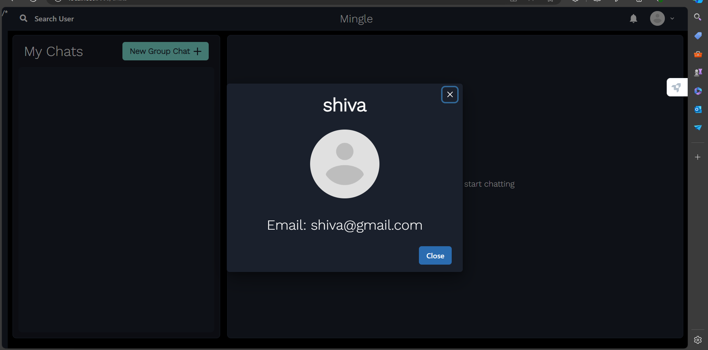

# 🗨️ MERN Stack Chatting App

This project is a full-stack chatting application built using the MERN stack: MongoDB, Express.js, React, and Node.js. The application provides a robust platform for real-time communication with features such as group chats, individual chats, and profile management.

## Technologies Used

<div style="display: flex; align-items: center;">
  
  
  
  
</div>
<div style="display: flex; align-items: center;">
  <span><strong>MongoDB</strong></span>
  <span style="margin-left: 50px;"><strong>Express.js</strong></span>
  <span style="margin-left: 50px;"><strong>React</strong></span>
  <span style="margin-left: 50px;"><strong>Node.js</strong></span>
</div>

## ⭐ Features

- **User Authentication:** Secure user authentication with JWT.
- **Real-time Messaging:** Instant messaging with socket.io.
- **Group Chats:** Create and manage group chats.
- **Individual Chats:** One-on-one messaging.
- **Profile Management:** Users can update their profiles.
- **Media Sharing:** Share images within chats.

## 📸 Screenshots

### 🏠 Main Page


### 🔑 Login Page


### 📝 Signup Page


### 🗂️ Group Chat


### 🗨️ Chats


### 📝 Group Settings Update


### 👤 User Profile


### 📨 Received Group Chat


### 📧 Received Message


## 🛠️ Installation

1. Clone the repository:
   ```bash
   git clone https://github.com/your-username/mern-chatting-app.git
